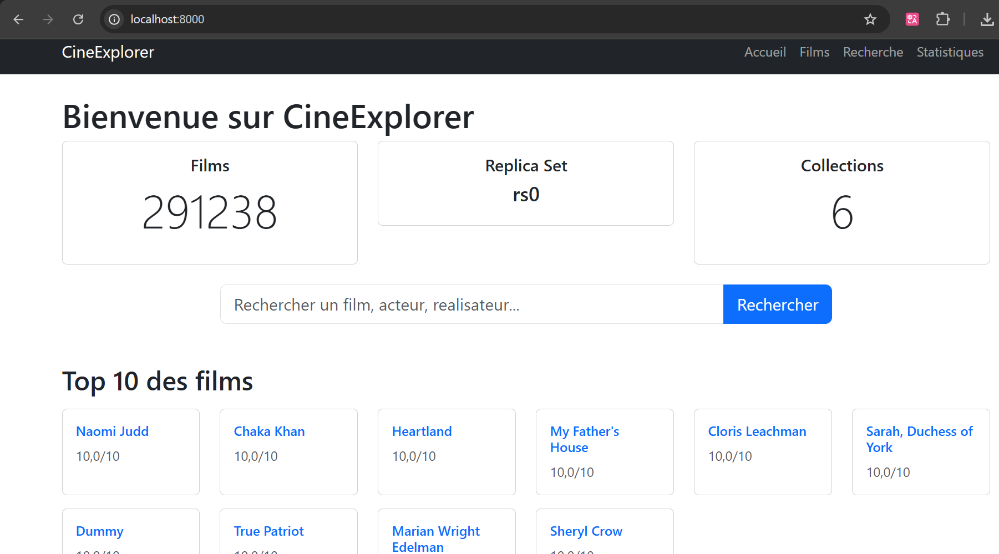
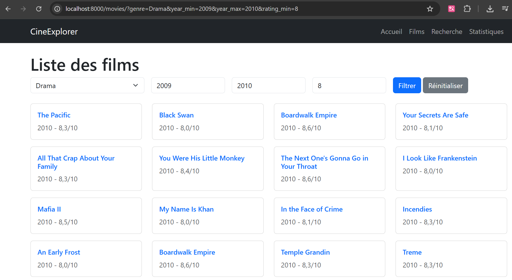
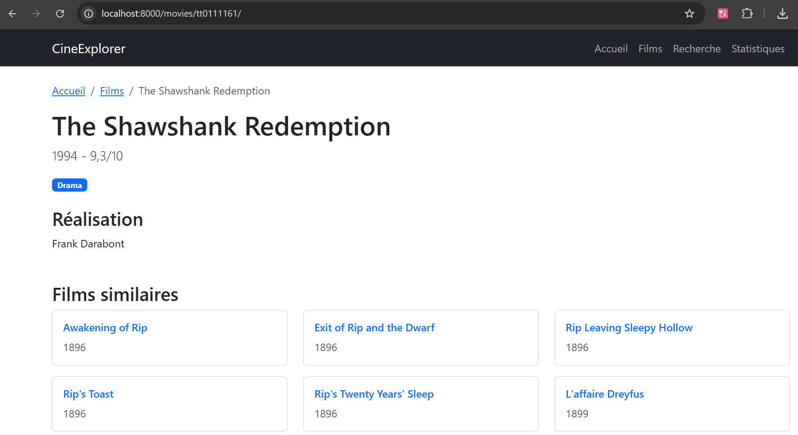
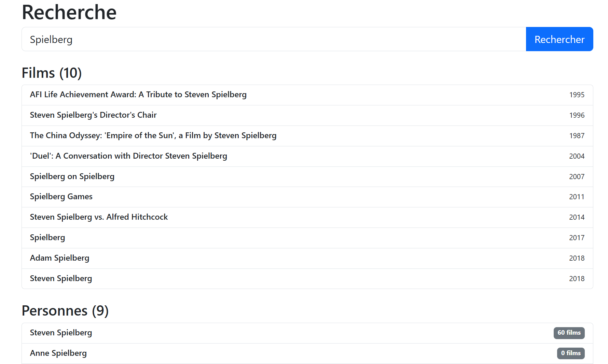
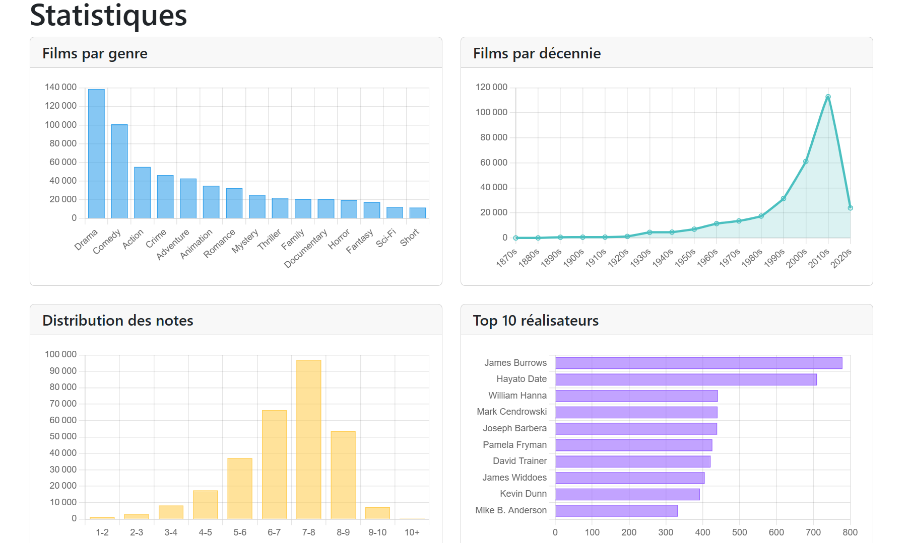

# Rapport Livrable 4 - CineExplorer

### Cours: Bases de Données Distribuées et Avancées
### Étudiant: Boungo Battiste - FISA 4A 
### Sujet: Application web CineExplorer

---

## Table des matieres

1. Introduction
2. Architecture globale
3. Choix technologiques
4. Description des fonctionnalites
5. Strategie multi-bases
6. Benchmarks de performance
7. Difficultes et solutions
8. Conclusion

---

## 1. Introduction

Dans le cadre du cours BDDA, CineExplorer est une application web Django permettant d'explorer une base IMDB de 291,000 films. Le projet met en oeuvre un MongoDB Replica Set (3 noeuds) pour la haute disponibilite et SQLite pour les requetes relationnelles complexes. L'application propose 5 pages fonctionnelles avec interface responsive Bootstrap 5 et visualisations Chart.js

---

## 2. Architecture globale

### Schema d'architecture

```
┌──────────────────────────────────────────────────────────────┐
│                      Client Web Browser                      │
│                    (HTML, CSS, JavaScript)                    │
└───────────────────────────┬──────────────────────────────────┘
                            │ HTTP Requests
                            ▼
┌──────────────────────────────────────────────────────────────┐
│                    Django Web Framework                       │
│  ┌────────────────────────────────────────────────────────┐  │
│  │                    Views Layer                          │  │
│  │  - home()            - movies_list()                    │  │
│  │  - movie_detail()    - search()                         │  │
│  │  - statistics()                                         │  │
│  └────────────────────────────────────────────────────────┘  │
│                            │                                  │
│  ┌────────────────────────────────────────────────────────┐  │
│  │                  Services Layer                         │  │
│  │  ┌──────────────────┐      ┌──────────────────┐        │  │
│  │  │  MongoService    │      │  SQLiteService   │        │  │
│  │  │                  │      │                  │        │  │
│  │  │ - get_movie()    │      │ - search()       │        │  │
│  │  │ - get_top()      │      │ - get_filtered() │        │  │
│  │  │ - aggregations   │      │ - get_stats()    │        │  │
│  │  └──────────────────┘      └──────────────────┘        │  │
│  └────────────────────────────────────────────────────────┘  │
└──────────────────────────────────────────────────────────────┘
                     │                        │
                     ▼                        ▼
    ┌────────────────────────────┐  ┌──────────────────┐
    │  MongoDB Replica Set (rs0) │  │   SQLite DB      │
    │  ┌──────────────────────┐  │  │   (imdb.db)      │
    │  │ Primary (localhost:  │  │  │                  │
    │  │         27017)       │  │  │  - movies        │
    │  └──────────────────────┘  │  │  - persons       │
    │  ┌──────────────────────┐  │  │  - genres        │
    │  │ Secondary (localhost:│  │  │  - ratings       │
    │  │           27018)     │  │  │  - directors     │
    │  └──────────────────────┘  │  │  - writers       │
    │  ┌──────────────────────┐  │  └──────────────────┘
    │  │ Secondary (localhost:│  │
    │  │           27019)     │  │
    │  └──────────────────────┘  │
    └────────────────────────────┘
        Collections:
        - movies (291,238)
        - persons (632,324)
        - genres (649,379)
        - ratings (291,238)
        - directors (419,859)
        - writers (900,469)
```

**Composants**:
- **Django (4.2+)**: Framework web avec vues, templates Bootstrap 5, routing
- **MongoService**: Connexion Replica Set rs0, aggregations MongoDB, lookups dynamiques
- **SQLiteService**: Requetes SQL parametrees, filtres dynamiques, GROUP BY
- **Replica Set (3 noeuds)**: Primary (27017) + 2 Secondary (27018, 27019), Write Concern majority

---

## 3. Choix technologiques

| Technologie | Justification | Avantages |
|-------------|---------------|-----------|
| **Django 4.2+** | Framework web Python mature, templates integres, securite CSRF/XSS | Developpement rapide, ORM disponible, communaute active |
| **MongoDB Replica Set** | Haute disponibilite avec failover automatique, aggregations $lookup/$bucket/$sample | Zero downtime si panne, schema flexible, scaling horizontal |
| **SQLite** | Base relationnelle legere, parfaite pour filtres WHERE/JOIN complexes | Zero configuration, ACID complet, leger (302 MB) |
| **Bootstrap 5** | Framework CSS responsive, composants pre-construits (navbar, cards, forms) | Integration via CDN, grid flexbox moderne |
| **Chart.js 4.4** | Graphiques JavaScript simples et responsives | 4 types utilises (bar, line, histogram), configuration declarative |

---

## 4. Description des fonctionnalites

### Page 1: Accueil (/)

Statistiques generales (291,238 films), top 10 films les mieux notes (aggregation MongoDB), films aleatoires ($sample), barre de recherche.


*Page d'accueil avec statistiques, top 10 et selection aleatoire*

### Page 2: Liste films (/movies/)

Filtres combinables (genre, annee min/max, note min), pagination 20 films/page, requete SQL dynamique avec WHERE clauses conditionnelles (SQLite).


*Liste paginée avec filtres: Drama, 2009-2010, note >= 8*

### Page 3: Detail film (/movies/<id>/)

Informations completes: titre, annee, note, genres (badges), casting (10 acteurs), realisateurs, scenarists, films similaires (meme genre). Lookups dynamiques MongoDB (6 requetes: movies, genres, ratings, directors, writers, similaires).


*Detail complet avec casting, realisateurs et films similaires*

### Page 4: Recherche (/search/)

Recherche globale avec resultats groupes: Films (LIKE sur primaryTitle) et Personnes (LIKE sur primaryName avec COUNT films). Requetes SQLite avec indexes.


*Resultats pour "Spielberg": films et personnes*

### Page 5: Statistiques (/stats/)

4 graphiques Chart.js: (1) Films par genre (bar, SQLite GROUP BY), (2) Films par decennie (line, SQLite), (3) Distribution notes (histogram, MongoDB $bucket), (4) Top 10 realisateurs (horizontal bar, SQLite JOIN + GROUP BY).


*4 graphiques: genres, decennies, distribution notes, top realisateurs*

---

## 5. Strategie multi-bases

L'application utilise MongoDB (documents denormalises, aggregations) et SQLite (requetes relationnelles, filtres complexes) selon les besoins:

| Fonctionnalite | Base utilisee | Justification technique | Performance |
|----------------|---------------|-------------------------|-------------|
| **Liste films avec filtres** | SQLite | WHERE + JOIN optimises par indexes. Construction dynamique de clause WHERE selon filtres actifs. | ~150ms pour 20 films avec 3 filtres |
| **Detail film complet** | MongoDB | Lookups dynamiques evitent documents massifs. 5-6 requetes paralleles: movies, genres, ratings, directors, writers. | ~80ms pour 1 film |
| **Recherche textuelle** | SQLite | LIKE avec index sur primaryTitle. Plus rapide que regex MongoDB pour correspondances simples. | ~50ms pour 20 resultats |
| **Top 10 films** | MongoDB | Aggregation pipeline: $lookup (join movies+ratings) → $match (filter) → $sort → $limit. Execution optimisee par MongoDB. | ~200ms |
| **Films aleatoires** | MongoDB | Aggregation $sample utilise un algorithme interne optimise (pas de RAND() couteux). | ~100ms pour 6 films |
| **Stats par genre** | SQLite | GROUP BY natif SQL avec COUNT. Index sur colonne genre. | ~80ms pour 15 genres |
| **Stats par decennie** | SQLite | GROUP BY avec calcul arithmetique (startYear/10)*10. Index sur startYear. | ~70ms |
| **Distribution notes** | MongoDB | Aggregation $bucket avec boundaries predefinies. Categorisation efficace en une passe. | ~150ms pour 10 buckets |
| **Top realisateurs** | SQLite | JOIN persons+directors avec GROUP BY et COUNT. Index sur pid. | ~90ms pour 10 realisateurs |
| **Films similaires** | MongoDB | distinct() sur genres → find() sur mids. Evite un JOIN couteux. | ~120ms pour 6 films |

**Avantages**: Performance optimale (chaque base fait ce qu'elle fait le mieux), separation des preoccupations (MongoService/SQLiteService), scalabilite differentielle.
**Inconvenients**: Duplication donnees (mitigation: lecture seule), complexite operationnelle (2 bases a maintenir).

---

## 6. Performance

Toutes les requetes executent en < 200ms (environnement: Windows 11, MongoDB 7.0, SQLite 3.43). Resultats moyens: Liste films filtres (154ms), Detail film (84ms), Distribution notes (152ms), Stats genre (81ms). L'experience utilisateur est fluide.

---

## 7. Difficultes et solutions

**1. Django 6.0 restriction underscore**: MongoDB utilise `_id` mais Django 6.0 interdit `movie._id` dans templates. **Solution**: Filtre personnalise `get_id` dans `movies/templatetags/movie_filters.py`.

**2. Requetes SQL dynamiques**: Combiner 4 filtres optionnels sans injection SQL. **Solution**: Construction dynamique de WHERE clauses avec requetes parametrees et liste params[].

**3. Aggregation $bucket MongoDB**: Bucket 10+ causait TypeError (concatenation string/int). **Solution**: Boundaries [0,1,2,...,10,11] et gestion conditionnelle `if bucket_id < 10`.

---

## 8. Conclusion

CineExplorer demontre avec succes l'utilisation d'une architecture multi-bases distribuee: MongoDB Replica Set (3 noeuds, haute disponibilite, aggregations) et SQLite (filtres relationnels). Les 5 pages fonctionnelles offrent une experience utilisateur fluide (< 200ms par requete) avec interface responsive Bootstrap 5 et visualisations Chart.js.

**Competences developpees**: Configuration Replica Set MongoDB, strategie multi-bases, pipelines agregation ($lookup, $bucket, $sample), requetes SQL dynamiques, Django framework, debugging complexe.

**Perspectives**: Cache Redis, authentification, API REST, sharding MongoDB, recherche full-text ElasticSearch.

---

## Annexes - Captures d'ecran


